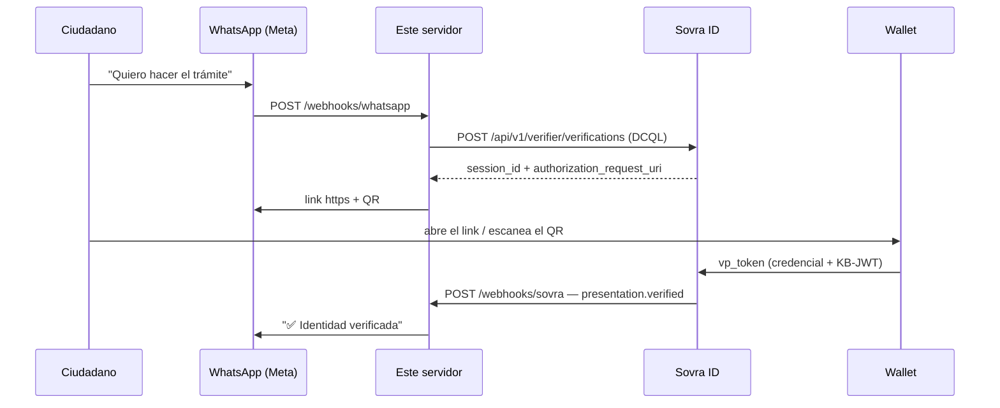

# WhatsApp × Sovra ID — verificación de credenciales

Bot de WhatsApp que **verifica una credencial verificable** dentro del chat, sin
app propia y sin portal: el ciudadano escribe, presenta desde su wallet, y el
trámite sigue.

Habla **directo con la Cloud API de Meta** (`graph.facebook.com`), sin BSP ni
intermediarios, y contra la **plataforma actual de Sovra** — SD-JWT VC, OID4VP +
DCQL, `Authorization: Bearer sovra_sk_...`.

> **Alcance:** este boilerplate asume que el ciudadano **ya tiene la credencial**
> en su wallet. Solo verifica. La emisión está en
> [`03-emision-de-credenciales.md`](../../../docs/guides/credentials/03-emision-de-credenciales.md).

## La conversación

```
→  Quiero hacer el trámite para la licencia
←  ¡Hola! 👋 Para hacer el trámite necesito verificar tu identidad.
   Abrí tu wallet y presentá tu credencial acá:
   https://tu-servidor/w/e2d16450-…
   ⏱ El link vence en 10 minutos. Si estás en la compu, escaneá el QR.
←  [imagen: QR]
   … toca el link, se abre la wallet, presenta …
←  ✅ *Identidad verificada.*
   Bienvenido/a, Gustavo Giorgetti.
   CUIL: 27-33918660-5

   Ya podés continuar con el trámite de tu licencia.
```

**El bot no le pregunta nada.** El primer mensaje ya devuelve el deep link, y los
datos del ciudadano llegan en el webhook: nombre, CUIL y teléfono salen de la
credencial, verificados, sin que nadie los tipee.

## Cómo funciona



Tres detalles que hacen que esto funcione:

**1. El deep link no es clickeable.** WhatsApp solo linkifica `http`/`https`, y la
URI de OID4VP es `openid4vp://…`. Por eso el bot manda una URL propia —
`GET /w/:sessionId`— que hace un **302 a la URI real**. Además manda el **QR como
imagen**, para quien lee WhatsApp desde la compu. La imagen la descarga *Meta*, no
el ciudadano: tiene que ser pública.

**2. La sesión de Sovra vive 10 minutos.** El bot lo avisa en el mensaje, y si el
ciudadano vuelve después de que venció le genera un link nuevo sin preguntar nada.

**3. El teléfono ata la credencial al chat.** Sovra valida que la credencial sea
auténtica, vigente, no revocada, y que quien la presentó sea su titular. Lo que
**no** puede saber es si ese titular es quien abrió *este* chat: el link se puede
reenviar. Por eso el bot compara el claim `phone` de la credencial contra el
`wa_id` de WhatsApp. El atacante no puede hacer que una credencial ajena declare
su propio número, así que ahí se corta.

Si tu esquema no lleva el teléfono, poné `PHONE_CLAIM = null` en
[`src/credential.ts`](src/credential.ts). El bot sigue andando, pero un link
reenviado puede asociar la identidad de otra persona a este chat.

## Probarlo sin credenciales

```bash
npm install
npm run demo
```

`npm run demo` stubbea `fetch` y corre la conversación entera —caso feliz, link
reenviado a otra persona, credencial revocada, cancelación— sin número de WhatsApp
ni API key. Es la forma más rápida de ver el flujo y de romperlo a propósito.

## Ponerlo a andar de verdad

### 1. Sovra

En el [dashboard](https://test-issuer-sovra.flagonsa.com):

| Dónde | Qué |
|---|---|
| Settings → API keys | Generá una API key (`sovra_sk_…`). |
| Settings → Workspace → Webhook URL | `https://tu-servidor/webhooks/sovra` |
| Settings → Workspace → Webhook secret | Generalo y copialo: **se muestra una sola vez**. |
| Schemas | Anotá los `key` exactos de los claims que vas a pedir. |

Los claims que vas a pedir se declaran en **[`src/credential.ts`](src/credential.ts)**,
no en `.env`: qué datos le pedís al ciudadano es la definición del trámite —una
decisión de producto y de privacidad— y merece pasar por code review, no editarse
en caliente en un servidor.

```ts
export const CLAIMS = ["cuil", "nombre", "apellido", "phone"] as const;
```

**Tienen que coincidir carácter por carácter** con los keys del esquema. Sensible a
mayúsculas, sin sinónimos: si el esquema declaró `fist_name` (con errata), pedir
`first_name` falla con `missing_required_claim:first_name`.

Y son **todos obligatorios**: si el ciudadano no divulga uno solo, la presentación
entera falla. Pedí el mínimo indispensable — es mejor para la privacidad y para la
tasa de éxito.

### 2. Meta

En [developers.facebook.com](https://developers.facebook.com):

1. Creá una app de tipo **Business** y agregale el producto **WhatsApp**.
2. **WhatsApp → API Setup**: anotá el **Phone number ID**. El número de prueba que
   te da Meta sirve para desarrollar; para producción registrá el tuyo.
3. **Business Settings → System Users**: generá un token **permanente** con los
   permisos `whatsapp_business_messaging` y `whatsapp_business_management`. El
   token temporal de la pantalla de API Setup dura 24 h — no lo uses para nada
   que no sea la primera prueba.
4. **App → Settings → Basic**: copiá el **App secret**. Con eso se validan los
   webhooks entrantes.
5. **WhatsApp → Configuration → Webhook**:
   - Callback URL: `https://tu-servidor/webhooks/whatsapp`
   - Verify token: el mismo string que pongas en `WHATSAPP_VERIFY_TOKEN`
   - Suscribite al campo **`messages`**.

   Meta pega un `GET` con `hub.challenge` para validar la URL. El servidor tiene
   que estar **corriendo y accesible** en ese momento, o la URL no se guarda.

### 3. Este servidor

```bash
cp .env.example .env    # completá las variables
npm install
npm run dev
```

Necesitás una URL pública HTTPS. En desarrollo:

```bash
ngrok http 3000
# pegá la URL https en PUBLIC_BASE_URL, y la misma en los dos webhooks
```

> Con ngrok gratuito la URL cambia en cada reinicio. Cuando cambie, actualizá
> `PUBLIC_BASE_URL`, la Callback URL en Meta y la Webhook URL en Sovra. Si no, el
> QR llega roto (Meta responde error `131014`).

## Variables de entorno

Todas están documentadas en [`.env.example`](.env.example). Las que más se
equivocan:

| Variable | Trampa |
|---|---|
| `PUBLIC_BASE_URL` | Tiene que ser **https y alcanzable desde internet**: Meta descarga el QR desde ahí. |
| `WHATSAPP_APP_SECRET` | Es el **App secret** de la app, no el token. Firma los webhooks entrantes. |
| `WHATSAPP_VERIFY_TOKEN` | Lo inventás vos, y tiene que ser **idéntico** acá y en Meta. |
| `SOVRA_WEBHOOK_SECRET` | Se muestra **una sola vez** al generarlo. Si lo perdiste, rotalo. |
| `PORTAL_URL` | Opcional. Si la dejás vacía, el mensaje de fallo no ofrece dónde sacar la credencial. |

> Los claims del DCQL **no son variables de entorno**: viven en
> [`src/credential.ts`](src/credential.ts).

## Estructura

```
src/
├── index.ts               Monta las rutas y levanta el servidor
├── config.ts              Variables de entorno, tipadas y validadas al arrancar
├── flow.ts                La máquina de estados del bot
├── credential.ts          Qué claims pedimos — la definición del trámite
├── messages.ts            Todo el texto que ve el ciudadano
├── whatsapp.ts            Cliente de la Cloud API + validación de X-Hub-Signature-256
├── sovra.ts               Cliente de Sovra + validación de X-Sovra-Signature
├── phone.ts               Conciliar el teléfono de la credencial con el wa_id
├── store.ts               Estado en memoria ⚠️ reemplazar por tu base de datos
└── routes/
    ├── whatsapp-webhook.ts  GET (handshake) + POST (mensajes entrantes)
    ├── sovra-webhook.ts     presentation.verified / presentation.failed
    └── wallet.ts            GET /w/:id → 302 a openid4vp://  ·  GET /qr/:id.png
scripts/
└── demo.ts                La conversación completa, con fetch stubbeado
```

La máquina de estados:

```
idle ──(cualquier mensaje)─────▶ awaiting_presentation   [link + QR]
     ──(presentation.verified)─▶ verified                [✅  o  ⚠️ otro teléfono]
     ──(presentation.failed)───▶ idle                    [❌ con motivo]
```

## Adaptarlo a tu trámite

| Querés cambiar | Tocá |
|---|---|
| El texto de los mensajes | `src/messages.ts` |
| Los datos que pedís | `CLAIMS` en `src/credential.ts` |
| El cotejo de teléfono (o apagarlo) | `PHONE_CLAIM` en `src/credential.ts` |
| Cómo se comparan los teléfonos | `SIGNIFICANT_DIGITS` en `src/phone.ts` |
| Qué pasa cuando la identidad se verifica | El final de `handleVerified` en `src/flow.ts` |
| Los pasos de la conversación | `handleMessage` en `src/flow.ts` |

## Antes de producción

- [ ] **Reemplazar `src/store.ts` por una base de datos.** Los `Map` se pierden en
      cada reinicio y no funcionan con más de una instancia. La interfaz es chica:
      `getConversation`, `saveConversation`, `linkSession`, `takeSession`,
      `alreadyHandled`.
- [ ] **Persistir la idempotencia.** `alreadyHandled` usa un `Set` en memoria; con
      varias instancias hace falta que sea compartido (Redis, o una tabla con
      índice único sobre el `id` de la entrega).
- [ ] **No loguear claims.** Los valores que llegan en `presentation.verified` son
      datos personales verificados. Este boilerplate no los loguea; mantenelo así.
- [ ] **Encolar el trabajo.** Los dos webhooks responden `200` y siguen en
      background. Con volumen real eso quiere ser una cola, no un `.catch()`.
- [ ] **La ventana de 24 horas.** Fuera de las 24 h desde el último mensaje del
      ciudadano, WhatsApp **solo** deja mandar plantillas aprobadas. Todo el flujo
      de acá es respuesta a un mensaje del ciudadano, así que entra en la ventana
      libre — pero si tu trámite le escribe primero, vas a necesitar una plantilla.
- [ ] **Rate limits.** La Cloud API tiene límites por número y por tier. Manejá el
      `429` con reintento exponencial.

## Referencias

- [Guías de credenciales de Sovra](../../../docs/guides/credentials/) — la fuente de verdad de la API.
- [4. Verificación de credenciales](../../../docs/guides/credentials/04-verificacion-de-credenciales.md) — DCQL, las dos URIs, qué valida Sovra.
- [5. Webhooks](../../../docs/guides/credentials/05-webhooks.md) — firma HMAC, reintentos, catálogo de eventos.
- [8. Errores y troubleshooting](../../../docs/guides/credentials/08-errores-y-troubleshooting.md) — cada código de error y su solución.
- [Cloud API de Meta](https://developers.facebook.com/docs/whatsapp/cloud-api) — referencia oficial.
