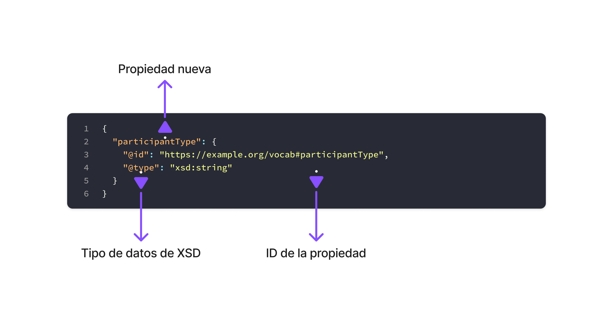
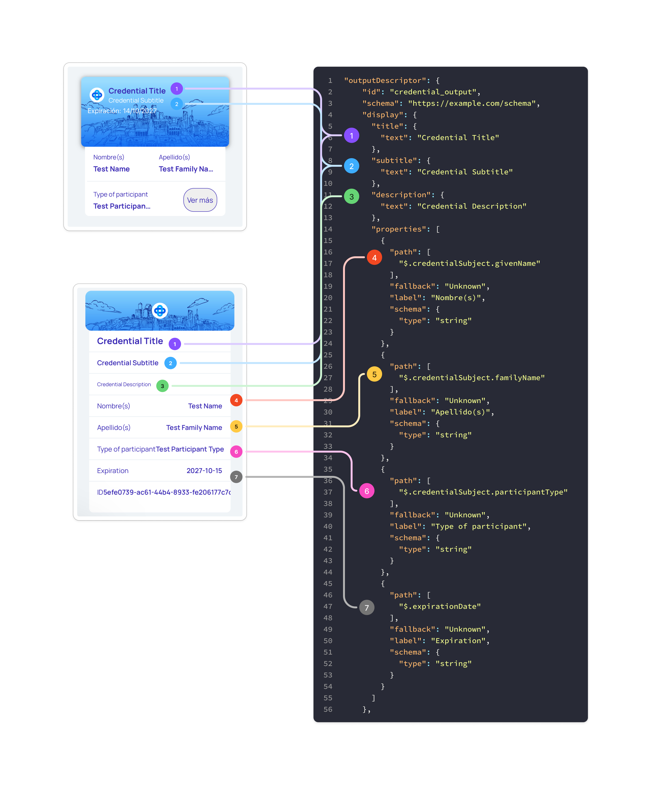

# Documentación Sovra ID API

## Tabla de Contenidos
1. [Introducción](#introducción)
2. [Configuración Inicial](#configuración-inicial)
3. [Endpoints](#endpoints)
   - 3.1 [Verificación del Workspace](#31-verificación-del-workspace)
   - 3.2 [Creación y Gestión de Credenciales](#32-creación-y-gestión-de-credenciales)
   - 3.3 [Creación y Gestión de Verificación](#33-creación-y-gestión-de-verificación)
4. [Referencia Completa de Campos](#referencia-completa-de-campos)
5. [Ejemplos y Referencias](#ejemplos-y-referencias)

---

## Introducción

Esta documentación te guiará paso a paso para configurar tu cuenta, acceder a la API y utilizar todas las funcionalidades disponibles de Sovra ID.

### ¿Qué podrás hacer?

Con esta guía aprenderás a:

- Obtener el ID del Workspace y verificar la configuración de tu cuenta.
- Crear credenciales verificables con datos personalizados.
- Consultar los detalles de cualquier credencial emitida.
- Gestionar el estado de las credenciales (suspender, revocar o activar).
- Crear verificaciones para validar credenciales de terceros.

### Estructura de la Guía

La documentación está organizada en los siguientes pasos:

1. **Configuración inicial** - Registro de usuario y obtención de la `x-api-key`
    1. Pasos para crear cuenta
    2. Verificación de la cuenta
2. **Endpoints** 
    1. **Verificación del Workspace** - Consulta del estado del workspace.
    2. **Creación y gestión de Credenciales** - Estructura de datos, ejemplos de solicitud, consulta de detalles y control de estados
    3. **Creación de gestión de Verificación** -  Estructura de datos, ejemplos de solicitud y consulta de detalles.

Cada sección incluye ejemplos prácticos, códigos de respuesta y tablas de referencia para facilitar la integración con tu aplicación.

**Nota:** Esta guía está diseñada para el entorno Sandbox.

---

## Configuración Inicial

Para comenzar a utilizar la API de Sovra ID, necesitas crear una cuenta en el entorno **Sandbox**. Este entorno te permite probar todas las funcionalidades sin afectar datos de producción.

- <a href="https://id.sandbox.sovra.io/" target="_blank">Acceder a Aplicación - Sovra Sandbox</a>

- <a href=https://id.api.sandbox.sovra.io/api target="_blank">Acceder a Swagger - Sovra Sandbox API</a>

- <a href='../resources/api_sovra_id.postman_collection.json' target="_blank">Descargar JSON Postman</a>


### Pasos para crear cuenta

**Paso 1: Crear Nueva Cuenta**

1. Haz clic en **"¿Don't have an account?"** en la página de inicio de sesión
2. Completa el formulario de registro con la siguiente información:

| Campo | Valor de Ejemplo | Descripción |
| --- | --- | --- |
| **Organization Name** | Integration 01 | Nombre de tu organización |
| **Workspace Name** | Integration 01 | Nombre del workspace inicial |
| **First Name** | John | Tu nombre |
| **Last Name** | Doe | Tu apellido |
| **Email** | name@yourbusiness.com | Email corporativo válido |
| **Password** | ******* | Contraseña segura sobre 6 caracteres |

**Paso 2: Acceder a la Configuración del Workspace**

Una vez completado el registro:

1. **Inicia sesión** con tus credenciales
2. Navega a la sección **"Workspace"** desde el menú principal
3. Encontrarás la información de configuración de tu workspace

**Paso 3: Obtener Credenciales de Acceso**

En la sección de Workspace podrás ver:

- **DID (Decentralized Identifier)**: Tu identificador único descentralizado
- **API Key**: Tu clave de acceso para la API (formato x-api-key)

<aside>

 **Importante**: El DID puede tardar entre **3 y 5 minutos** en generarse después del registro. Si no aparece inmediatamente, espera unos minutos y recarga la página.

</aside>

### Verificación de la cuenta

Una vez que tengas tu `x-api-key`, puedes verificar que todo esté funcionando correctamente haciendo una solicitud de prueba al endpoint de estado del workspace (ver sección siguiente).

---

## Endpoints

La API de Sovra ID proporciona endpoints para la gestión de credenciales verificables, verificaciones y workspaces. Todos los endpoints requieren autenticación mediante API Key en el header `x-api-key`.

**Base URL:** `https://id.api.sandbox.sovra.io/api`

**Autenticación:** API Key en header `x-api-key`

## 3.1 Verificación del Workspace

#### GET `/workspaces/status`

Obtiene el estado y configuración del workspace actual.

**Headers:**
```
x-api-key: TU_API_KEY
```

**Respuesta Exitosa (200):**
```json
[
  {
    "id": "c7b8ef84-cfcf-461c-afec-64abcfedth",
    "workspace_number": 1,
    "name": "Integration 01",
    "description": "Workspace por defecto de Integration 01",
    "status": true,
    "is_default": false,
    "did": "did:quarkid:EiaaaaaSOpt50p8vSx2L264abcfegdthg",
    "metadata": {
      "created_at": "2025-10-15T16:19:04.571Z",
      "created_by": "system",
      "is_default": true
    },
    "webhook_url": "https://id.api.sandbox.sovra.io/api/webhooks",
    "webhook_secret": "538aaa1212aaaaaaa",
    "branding": null,
    "apikey": "219a8CqHinSVL/X64abcfegdthg",
    "created_at": "2025-10-15T16:19:04.006Z",
    "updated_at": "2025-10-15T16:21:40.850Z"
  }
]
```

**Campos de Respuesta:**

| Campo | Tipo | Descripción |
|-------|------|-------------|
| `id` | string | ID único del workspace |
| `workspace_number` | number | Número incremental del workspace |
| `name` | string | Nombre del workspace |
| `description` | string | Descripción del workspace |
| `status` | boolean | Estado actual del workspace (activo/inactivo) |
| `is_default` | boolean | Si es el workspace por defecto, se carga primero en la aplicación |
| `did` | string | Identificador descentralizado del workspace |
| `metadata` | object | Metadatos adicionales del workspace |
| `webhook_url` | string | URL para recibir eventos webhook |
| `webhook_secret` | string | Secreto para validar firmas webhook |
| `branding` | object | Configuración de marca del workspace |
| `apikey` | string | API Key para comunicación con la API |
| `created_at` | string | Fecha de creación |
| `updated_at` | string | Fecha de última actualización |

---

**Si el `did` ya se encuentra creado, el workspace se encuentra listo para crear y verificar credenciales.**

## 3.2 Creación y Gestión de Credenciales

#### POST `/credentials/workspace/{workspace_id}`

Crea una nueva credencial verificable.

**Headers:**
```
x-api-key: TU_API_KEY
Content-Type: application/json
```

**Parámetros de URL:**
- `workspace_id` (string): ID del workspace donde crear la credencial

**Cuerpo de la Solicitud:**
```json
{
  "credential": {
    "@context": [
      "https://www.w3.org/2018/credentials/v1",
      "https://www.w3.org/2018/credentials/examples/v1",
      "https://w3id.org/security/bbs/v1",
      {
        "participantType": {
          "@id": "https://example.org/vocab#participantType",
          "@type": "xsd:string"
        }
      }
    ],
    "type": ["VerifiableCredential"],
    "expirationDate": "2027-10-15",
    "credentialSubject": {
      "givenName": "Test Name",
      "familyName": "Test Family Name",
      "participantType": "Test Participant Type"
    }
  },
  "outputDescriptor": {
    "id": "credential_output",
    "schema": "https://example.com/schema",
    "display": {
      "title": {
        "text": "Credential Title"
      },
      "subtitle": {
        "text": "Credential Subtitle"
      },
      "description": {
        "text": "Credential Description"
      },
      "properties": [
        {
          "path": ["$.credentialSubject.givenName"],
          "fallback": "Unknown",
          "label": "Nombre(s)",
          "schema": {
            "type": "string"
          }
        },
        {
          "path": ["$.credentialSubject.familyName"],
          "fallback": "Unknown",
          "label": "Apellido(s)",
          "schema": {
            "type": "string"
          }
        },
        {
          "path": ["$.credentialSubject.participantType"],
          "fallback": "Unknown",
          "label": "Type of participant",
          "schema": {
            "type": "string"
          }
        },
        {
          "path": ["$.expirationDate"],
          "fallback": "Unknown",
          "label": "Expiration",
          "schema": {
            "type": "string"
          }
        }
      ]
    },
    "styles": {
      "text": {
        "color": "#ffffff"
      },
      "hero": {
        "uri": "https://storage.googleapis.com/sovra_brand/BG.png",
        "alt": "Your Background Alt Text"
      },
      "background": {
        "color": "#0b1f45"
      },
      "thumbnail": {
        "uri": "https://storage.googleapis.com/sovra_brand/Logo.png",
        "alt": "Your Logo Alt Text"
      }
    }
  }
}
```

**Campos de Solicitud (Body):**

| Campo | Tipo de Dato | Descripción | Generación | Momento de existencia |
|-------|--------------|-------------|-------------|---------------------|
| `credential.@context` | array de string, object | Define las propiedades usados por la credencial. Puedes extenderlo con propiedades personalizadas | Manual | Al crear (body) |
| `credential.type` | string[] | Siempre debe contener "VerifiableCredential" como primer elemento | Manual | Al crear (body) |
| `credential.issuanceDate` | string (YYYY-MM-DD) | Fecha de emisión de la credencial | Automática | Al crear (respuesta) |
| `credential.expirationDate` | string (YYYY-MM-DD) | Fecha de expiración de la credencial | Manual | Al crear (body) |
| `credential.credentialSubject` | object | Contiene los datos específicos del portador de la credencial. Debe coincidir con las propiedades definidas en @context | Manual | Al crear (body) |
| `outputDescriptor.id` | string | Identificador único del descriptor de salida | Manual | Al crear (body) |
| `outputDescriptor.schema` | string | URL del schema que define la estructura de la credencial | Manual | Al crear (body) |
| `outputDescriptor.display` | object | Configuración de visualización de la credencial | Manual | Al crear (body) |
| `outputDescriptor.display.title` | object | Título principal de la credencial | Manual | Al crear (body) |
| `outputDescriptor.display.subtitle` | object | Subtítulo de la credencial | Manual | Al crear (body) |
| `outputDescriptor.display.description` | object | Descripción detallada de la credencial | Manual | Al crear (body) |
| `outputDescriptor.display.properties` | array | Array de propiedades que se mostrarán en la credencial | Manual | Al crear (body) |
| `outputDescriptor.display.properties[].path` | array | Ruta JSONPath para acceder al valor en la credencial | Manual | Al crear (body) |
| `outputDescriptor.display.properties[].fallback` | string | Valor por defecto si no se encuentra el campo | Manual | Al crear (body) |
| `outputDescriptor.display.properties[].label` | string | Etiqueta que se mostrará para la propiedad | Manual | Al crear (body) |
| `outputDescriptor.display.properties[].schema` | object | Definición del tipo de dato de la propiedad | Manual | Al crear (body) |
| `outputDescriptor.styles` | object | Define los estilos visuales de la credencial | Manual | Al crear (body) |
| `outputDescriptor.styles.text` | object | Configuración de color del texto | Manual | Al crear (body) |
| `outputDescriptor.styles.hero` | object | Imagen de fondo principal con URI y texto alternativo | Manual | Al crear (body) |
| `outputDescriptor.styles.background` | object | Color de fondo de la credencial | Manual | Al crear (body) |
| `outputDescriptor.styles.thumbnail` | object | Imagen miniatura (logo) con URI y texto alternativo | Manual | Al crear (body) |

**Respuesta Exitosa (201):**
```json
{
  "id": "541ffd6d-8702-4489-b7df-76233e24e685",
  "invitation_wallet": {
    "invitationId": "cf8cf509-1e61-4a1c-b8fd-05aa35a6e35b",
    "invitationContent": "didcomm://?_oob=eyJ0eXBlIjoiaHR0cHM6Ly9kaWRjb21tLm9yZy9vdXQtb2YtYmFuZC8yLjAvaW52aXRhdGlvbiIsImlkIjoiY2Y4Y2Y1MDktMWU2MS00YTFjLWI4ZmQtMDVhYTM1YTZlMzViIiwiZnJvbSI6ImRpZDpxdWFya2lkOkVpQWpkdmVnMmRYblVWcnNCVnFmcU1KckUxQXBXeG11UEJDc2d6Skp2Yi1qbXciLCJib2R5Ijp7ImdvYWxfY29kZSI6InN0cmVhbWxpbmVkLXZjIiwiYWNjZXB0IjpbImRpZGNvbW0vdjIiXX19"
  },
  "credential": {
    "type": [
      "VerifiableCredential"
    ],
    "@context": [
      "https://www.w3.org/2018/credentials/v1",
      "https://www.w3.org/2018/credentials/examples/v1",
      "https://w3id.org/security/bbs/v1",
      {
        "participantType": {
          "@id": "https://example.org/vocab#participantType",
          "@type": "xsd:string"
        }
      }
    ],
    "expirationDate": "2027-09-04",
    "credentialSubject": {
      "givenName": "Test Name",
      "familyName": "Test Family Name",
      "participantType": "Test Participant Type"
    },
    "id": "https://id.api.sandbox.sovra.io/api/credentials/541ffd6d-8702-4489-b7df-76233e24e685",
    "issuer": {
      "id":"did:quarkid:EiBppRyATSOpt50p8vSx2L2Hud8IHawvwOp_Q04HEn2k7A",
      "name": "Integration 01"
    }
    "issuanceDate": "2025-10-16",
    "credentialStatus": {
      "id": "https://id.api.sandbox.sovra.io/api/public/credentials/status/541ffd6d-8702-4489-b7df-76233e24e685",
      "type": "CredentialStatusList2017"
    }
  },
  "outputDescriptor": {
    "id": "credential_output",
    "schema": "https://example.com/schema",
    "styles": {
      "thumbnail": {
        "uri": "string",
        "alt": "string"
      },
      "hero": {
        "uri": "string",
        "alt": "string"
      },
      "background": {
        "color": "string"
      },
      "text": {
        "color": "string"
      }
    },
    "display": {
      "title": {
        "text": "Credential Text"
      },
      "subtitle": {
        "text": "Credential Text"
      },
      "description": {
        "text": "Credential Text"
      },
      "properties": [
        {
          "path": [
            "$.credentialSubject.givenName"
          ],
          "fallback": "Unknown",
          "label": "Nombre(s)",
          "schema": {
            "type": "string"
          }
        }
      ]
    }
  }
}
```

**Campos de Respuesta - Creación:**

| Campo | Tipo de Dato | Descripción | Generación | Momento de existencia |
|-------|--------------|-------------|-------------|---------------------|
| `id` | string | ID único de la credencial | Automática | Al crear (respuesta) |
| `invitation_wallet.invitationId` | string | ID único de la invitación para conectar con la wallet del usuario | Automática | Al crear (respuesta) |
| `invitation_wallet.invitationContent` | string | URL de invitación DIDComm para establecer conexión con la wallet del usuario | Automática | Al crear (respuesta) |
| `credential.id` | string | ID único de la credencial | Automática | Al crear (respuesta) |
| `credential.issuanceDate` | string (YYYY-MM-DD) | Fecha de emisión de la credencial | Automática | Al crear (respuesta) |
| `credential.credentialStatus` | object | Estado de la credencial con información de revocación | Automática | Al crear (respuesta) |
| `credential.issuer.id` | string | DID del Workspace | Automática | Al crear (respuesta) |
| `credential.issuer.name` | string | Nombre del Workspace | Automática | Al crear (respuesta) |

#### GET `/credentials/{id}`

Detalles de la credencial verificable.

**Headers:**
```
x-api-key: TU_API_KEY
Content-Type: application/json
```

**Parámetros de URL:**
- `id` (string): ID de la credencial

**Respuesta Exitosa (200):**
```json
{
  "id": "541ffd6d-8702-4489-b7df-76233e24e685",
  "invitation_wallet": {
    "invitationId": "cf8cf509-1e61-4a1c-b8fd-05aa35a6e35b",
    "invitationContent": "didcomm://?_oob=eyJ0eXBlIjoiaHR0cHM6Ly9kaWRjb21tLm9yZy9vdXQtb2YtYmFuZC8yLjAvaW52aXRhdGlvbiIsImlkIjoiY2Y4Y2Y1MDktMWU2MS00YTFjLWI4ZmQtMDVhYTM1YTZlMzViIiwiZnJvbSI6ImRpZDpxdWFya2lkOkVpQWpkdmVnMmRYblVWcnNCVnFmcU1KckUxQXBXeG11UEJDc2d6Skp2Yi1qbXciLCJib2R5Ijp7ImdvYWxfY29kZSI6InN0cmVhbWxpbmVkLXZjIiwiYWNjZXB0IjpbImRpZGNvbW0vdjIiXX19"
  },
  "credential": {
    "type": [
      "VerifiableCredential"
    ],
    "@context": [
      "https://www.w3.org/2018/credentials/v1",
      "https://www.w3.org/2018/credentials/examples/v1",
      "https://w3id.org/security/bbs/v1",
      {
        "participantType": {
          "@id": "https://example.org/vocab#participantType",
          "@type": "xsd:string"
        }
      }
    ],
    "expirationDate": "2027-09-04",
    "credentialSubject": {
      "id": "did:quarkid:EiCYG42rgXScE37NpavexEiRUjc6RJd0Hotz5KXY22tuYQ",
      "givenName": "Test Name",
      "familyName": "Test Family Name",
      "participantType": "Test Participant Type"
    },
    "id": "https://id.api.sandbox.sovra.io/api/credentials/541ffd6d-8702-4489-b7df-76233e24e685",
    "issuer": {
      "id":"did:quarkid:EiBppRyATSOpt50p8vSx2L2Hud8IHawvwOp_Q04HEn2k7A",
      "name": "Integration 01"
    },
    "issuanceDate": "2025-10-16",
    "credentialStatus": {
      "id": "https://id.api.sandbox.sovra.io/api/public/credentials/status/541ffd6d-8702-4489-b7df-76233e24e685",
      "type": "CredentialStatusList2017"
    },
    "proof": {
      "type": "BbsBlsSignature2020",
      "created": "2025-10-16T15:23:47Z",
      "proofValue": "hj0rPoXueJKlMalnTTGtTB1thgw2xyA7mlpzekQe9FcsfjPZO+XuSgYyrwKFvle/MKVg9X44OT7IyqxonIH7xLuNJjBkG7KYma9urLMBCo4x5JoTWPaG1p7URXapIpy1ng+avITVXJin9XQoxPxyNA==",
      "proofPurpose": "assertionMethod",
      "verificationMethod": "did:quarkid:EiBppRyATSOpt50p8vSx2L2Hud8IHawvwOp_Q04HEn2k7A#vc-bbsbls"
    }
  },
  "outputDescriptor": {
    "id": "credential_output",
    "schema": "https://example.com/schema",
    "styles": {
      "thumbnail": {
        "uri": "string",
        "alt": "string"
      },
      "hero": {
        "uri": "string",
        "alt": "string"
      },
      "background": {
        "color": "string"
      },
      "text": {
        "color": "string"
      }
    },
    "display": {
      "title": {
        "text": "Credential Text"
      },
      "subtitle": {
        "text": "Credential Text"
      },
      "description": {
        "text": "Credential Text"
      },
      "properties": [
        {
          "path": [
            "$.credentialSubject.givenName"
          ],
          "fallback": "Unknown",
          "label": "Nombre(s)",
          "schema": {
            "type": "string"
          }
        }
      ]
    }
  },
  "tenant_id": "c7b8ef84-cfcf-461c-afec-64457be59253",
  "holder_did": "did:quarkid:EiCYG42rgXScE37NpavexEiRUjc6RJd0Hotz5KXY22tuYQ"
}
```

**Campos de Respuesta - Consulta:**

| Campo | Tipo de Dato | Descripción | Generación | Momento de existencia |
|-------|--------------|-------------|-------------|---------------------|
| `credential.credentialSubject.id` | string | DID del portador de la credencial | Automática | Al asociar |
| `credential.proof` | object | Prueba criptográfica de la credencial | Automática | Al asociar |
| `credential.proof.type` | string | Tipo de firma criptográfica utilizada | Automática | Al asociar |
| `credential.proof.created` | string (ISO 8601) | Fecha y hora de creación de la prueba | Automática | Al asociar |
| `credential.proof.proofValue` | string | Valor de la prueba criptográfica | Automática | Al asociar |
| `credential.proof.proofPurpose` | string | Propósito de la prueba (assertionMethod) | Automática | Al asociar |
| `credential.proof.verificationMethod` | string | Método de verificación utilizado | Automática | Al asociar |
| `tenant_id` | string | ID del tenant/workspace | Automática | Al asociar |
| `holder_did` | string | DID del portador de la credencial | Automática | Al asociar |

#### GET `/public/credentials/status/{credential_id}`

Verifica el estado de una credencial.

**Headers:**
```
x-api-key: TU_API_KEY
```

**Parámetros de URL:**
- `credential_id` (string): ID único de la credencial

**Respuesta Exitosa (200) - Credencial Activa:**
```json
{
  "verifiableCredential": []
}
```

**Campos de Respuesta - Credencial Activa:**

| Campo | Tipo | Descripción |
|-------|------|-------------|
| `verifiableCredential` | array | Array vacío cuando la credencial está activa |

**Respuesta de Error (404):**
```json
{
  "error": "Credential not found"
}
```

**Respuesta Exitosa (200) - Credencial Revocada/Suspendida:**
```json
{
  "verifiableCredential": [
    {
      "claim": {
        "id": "https://id.api.sandbox.sovra.io/api/public/credentials/541ffd6d-8702-4489-b7df-76233e24e685",
        "currentStatus": "revoked",
        "statusReason": "blocked credential"
      }
    }
  ]
}
```

**Campos de Respuesta - Credencial Revocada/Suspendida:**

| Campo | Tipo | Descripción |
|-------|------|-------------|
| `verifiableCredential` | array | Array de credenciales verificables |
| `verifiableCredential[].claim` | object | Información del reclamo de la credencial |
| `verifiableCredential[].claim.id` | string | ID de la credencial |
| `verifiableCredential[].claim.currentStatus` | string | Estado actual de la credencial |
| `verifiableCredential[].claim.statusReason` | string | Motivo del cambio de estado |

#### PUT `/credentials/{credential_id}/workspace/{workspace_id}/status/{status}`

Cambia el estado de una credencial (revocar, suspender o activar).

**Headers:**
```
x-api-key: TU_API_KEY
```

**Parámetros de URL:**
- `credential_id` (string): ID único de la credencial
- `workspace_id` (string): ID del workspace
- `status` (string): Nuevo estado (`revoked`, `suspend`, `active`)

**Cuerpo de la Solicitud (Opcional):**
```json
{
  "reason": "Motivo del cambio de estado"
}
```

**Respuesta Exitosa (200):**
```json
true
```

---

## 3.3 Creación y Gestión de Verificación

#### POST `/verifications/workspace/{workspace_id}`

Crea una nueva verificación de credencial.

**Headers:**
```
x-api-key: TU_API_KEY
Content-Type: application/json
```

**Parámetros de URL:**
- `workspace_id` (string): ID del workspace donde crear la verificación

**Cuerpo de la Solicitud:**
```json
{
  "inputDescriptors": [
    {
      "id": "VerifiableCredential",
      "name": "VerifiableCredential",
      "constraints": {
        "fields": [
          {
            "path": ["$.credentialSubject.givenName"],
            "filter": { "type": "string" }
          },
          {
            "path": ["$.credentialSubject.familyName"],
            "filter": { "type": "string" }
          },
          {
            "path": ["$.credentialSubject.participantType"],
            "filter": { "type": "string" }
          }
        ]
      }
    }
  ],
  "issuer": {
    "name": "Sovra ID",
    "styles": {
      "thumbnail": {
        "uri": "https://storage.googleapis.com/sovra_brand/Logo.png",
        "alt": "Sovra Logo"
      },
      "hero": {
        "uri": "https://storage.googleapis.com/sovra_brand/BG.png",
        "alt": "Background"
      },
      "background": {
        "color": "#0b1f45"
      },
      "text": {
        "color": "#ffffff"
      }
    }
  }
}
```

**Respuesta Exitosa (201):**
```json
{
  "id": "093adec6-c86e-4a7a-81c0-fa2a121212a",
  "presentation_wallet": {
    "presentationId": "string",
    "presentationContent": "string"
  },
  "inputDescriptors": [
    {
      "id": "VerifiableCredential",
      "name": "VerifiableCredential",
      "constraints": {
        "fields": [
          {
            "path": [
              "$.credentialSubject.givenName"
            ],
            "filter": {
              "type": "string"
            }
          }
        ]
      }
    }
  ],
  "issuer": {
    "name": "string",
    "styles": {
      "thumbnail": {
        "uri": "string",
        "alt": "string"
      },
      "hero": {
        "uri": "string",
        "alt": "string"
      },
      "background": {
        "color": "string"
      },
      "text": {
        "color": "string"
      }
    }
  }
}
```


**Campos de Solicitud (Body):**

| Campo | Tipo de Dato | Descripción | Generación | Momento de existencia |
|-------|--------------|-------------|-------------|---------------------|
| `inputDescriptors` | array | Array de descriptores de entrada que definen qué credenciales se pueden presentar | Manual | Al crear (requests) |
| `inputDescriptors[].id` | string | Identificador único del descriptor de entrada | Manual | Al crear (requests) |
| `inputDescriptors[].name` | string | Nombre descriptivo del descriptor de entrada | Manual | Al crear (requests) |
| `inputDescriptors[].constraints` | object | Restricciones que deben cumplir las credenciales | Manual | Al crear (requests) |
| `inputDescriptors[].constraints.fields` | array | Array de campos que deben estar presentes en la credencial | Manual | Al crear (requests) |
| `inputDescriptors[].constraints.fields[].path` | array | Ruta JSONPath para acceder al campo en la credencial | Manual | Al crear (requests) |
| `inputDescriptors[].constraints.fields[].filter` | object | Filtro que define el tipo de dato esperado | Manual | Al crear (requests) |
| `inputDescriptors[].constraints.fields[].filter.type` | string | Tipo de dato esperado (string, number, boolean, etc.) | Manual | Al crear (requests) |
| `issuer` | object | Configuración del emisor para la verificación | Manual | Al crear (requests) |
| `issuer.name` | string | Nombre del emisor | Manual | Al crear (requests) |
| `issuer.styles` | object | Estilos visuales para la verificación | Manual | Al crear (requests) |
| `issuer.styles.thumbnail` | object | Imagen miniatura (logo) con URI y texto alternativo | Manual | Al crear (requests) |
| `issuer.styles.hero` | object | Imagen de fondo principal con URI y texto alternativo | Manual | Al crear (requests) |
| `issuer.styles.background` | object | Color de fondo de la verificación | Manual | Al crear (requests) |
| `issuer.styles.text` | object | Configuración de color del texto | Manual | Al crear (requests) |

**Campos de Respuesta - Verificación:**

| Campo | Tipo de Dato | Descripción | Generación | Momento de existencia |
|-------|--------------|-------------|-------------|---------------------|
| `id` | string | ID único de la verificación | Automática | Al crear (responses) |
| `presentation_wallet.presentationId` | string | ID único de la presentación para conectar con la wallet del usuario | Automática | Al crear (responses) |
| `presentation_wallet.presentationContent` | string | URL de presentación DIDComm para establecer conexión con la wallet del usuario | Automática | Al crear (responses) |
| `inputDescriptors` | array | Array de descriptores de entrada que definen qué credenciales se pueden presentar | Manual | Al crear (requests) |
| `inputDescriptors[].id` | string | Identificador único del descriptor de entrada | Manual | Al crear (requests) |
| `inputDescriptors[].name` | string | Nombre descriptivo del descriptor de entrada | Manual | Al crear (requests) |
| `inputDescriptors[].constraints` | object | Restricciones que deben cumplir las credenciales | Manual | Al crear (requests) |
| `inputDescriptors[].constraints.fields` | array | Array de campos que deben estar presentes en la credencial | Manual | Al crear (requests) |
| `inputDescriptors[].constraints.fields[].path` | array | Ruta JSONPath para acceder al campo en la credencial | Manual | Al crear (requests) |
| `inputDescriptors[].constraints.fields[].filter` | object | Filtro que define el tipo de dato esperado | Manual | Al crear (requests) |
| `inputDescriptors[].constraints.fields[].filter.type` | string | Tipo de dato esperado (string, number, boolean, etc.) | Manual | Al crear (requests) |
| `issuer` | object | Configuración del emisor para la verificación | Manual | Al crear (requests) |
| `issuer.name` | string | Nombre del emisor | Manual | Al crear (requests) |
| `issuer.styles` | object | Estilos visuales para la verificación | Manual | Al crear (requests) |
| `issuer.styles.thumbnail` | object | Imagen miniatura (logo) con URI y texto alternativo | Manual | Al crear (requests) |
| `issuer.styles.hero` | object | Imagen de fondo principal con URI y texto alternativo | Manual | Al crear (requests) |
| `issuer.styles.background` | object | Color de fondo de la verificación | Manual | Al crear (requests) |
| `issuer.styles.text` | object | Configuración de color del texto | Manual | Al crear (requests) |

#### GET `/verifications/{id}`

Obtiene los detalles de una verificación específica.

**Headers:**
```
x-api-key: TU_API_KEY
Content-Type: application/json
```

**Parámetros de URL:**
- `id` (string): ID de la verificación

**Respuesta Exitosa (200):**
```json
{
  "id": "6addd52a-30a5-4540-9992-33638562b9c2",
  "presentation_wallet": {
    "presentationId": "string",
    "presentationContent": "string"
  },
  "inputDescriptors": [
    {
      "id": "VerifiableCredential",
      "name": "VerifiableCredential",
      "constraints": {
        "fields": [
          {
            "path": [
              "$.credentialSubject.givenName"
            ],
            "filter": {
              "type": "string"
            }
          }
        ]
      }
    }
  ],
  "issuer": {
    "name": "string",
    "styles": {
      "thumbnail": {
        "uri": "string",
        "alt": "string"
      },
      "hero": {
        "uri": "string",
        "alt": "string"
      },
      "background": {
        "color": "string"
      },
      "text": {
        "color": "string"
      }
    }
  },
  "role": "VERIFIER",
  "verified": true,
  "holder_did": "did:quarkid:EiCYG42rgXScE37NpavexEiRUjc6RJd0Hotz5KXY22tuYQ",
  "verifier_did": "did:quarkid:EiBppRyATSOpt50p8vSx2L2Hud8IHawvwOp_Q04HEn2k7A"
}
```

**Campos de Respuesta - Consulta de Verificación:**

| Campo | Tipo de Dato | Descripción | Generación | Momento de existencia |
|-------|--------------|-------------|-------------|---------------------|
| `id` | string | ID único de la verificación | Automática | Al crear (responses) |
| `presentation_wallet.presentationId` | string | ID único de la presentación para conectar con la wallet del usuario | Automática | Al crear (responses) |
| `presentation_wallet.presentationContent` | string | URL de presentación DIDComm para establecer conexión con la wallet del usuario | Automática | Al crear (responses) |
| `inputDescriptors` | array | Array de descriptores de entrada que definen qué credenciales se pueden presentar | Manual | Al crear (request) |
| `inputDescriptors[].id` | string | Identificador único del descriptor de entrada | Manual | Al crear (request) |
| `inputDescriptors[].name` | string | Nombre descriptivo del descriptor de entrada | Manual | Al crear (request) |
| `inputDescriptors[].constraints` | object | Restricciones que deben cumplir las credenciales | Manual | Al crear (request) |
| `inputDescriptors[].constraints.fields` | array | Array de campos que deben estar presentes en la credencial | Manual | Al crear (request) |
| `inputDescriptors[].constraints.fields[].path` | array | Ruta JSONPath para acceder al campo en la credencial | Manual | Al crear (request) |
| `inputDescriptors[].constraints.fields[].filter` | object | Filtro que define el tipo de dato esperado | Manual | Al crear (request) |
| `inputDescriptors[].constraints.fields[].filter.type` | string | Tipo de dato esperado (string, number, boolean, etc.) | Manual | Al crear (request) |
| `issuer` | object | Configuración del emisor para la verificación | Manual | Al crear (request) |
| `issuer.name` | string | Nombre del emisor | Manual | Al crear (request) |
| `issuer.styles` | object | Estilos visuales para la verificación | Manual | Al crear (request) |
| `issuer.styles.thumbnail` | object | Imagen miniatura (logo) con URI y texto alternativo | Manual | Al crear (request) |
| `issuer.styles.hero` | object | Imagen de fondo principal con URI y texto alternativo | Manual | Al crear (request) |
| `issuer.styles.background` | object | Color de fondo de la verificación | Manual | Al crear (request) |
| `issuer.styles.text` | object | Configuración de color del texto | Manual | Al crear (request) |
| `role` | string | Rol del usuario en la verificación (VERIFIER) | Automática | Al verificar |
| `verified` | boolean | Estado de verificación de la credencial | Automática | Al verificar |
| `holder_did` | string | DID del portador de la credencial | Automática | Al verificar |
| `verifier_did` | string | DID del verificador | Automática | Al verificar |

---

## Referencia Completa de Campos

### Campos de Respuesta por Etapa del Ciclo de Vida

Una credencial verificable pasa por diferentes etapas durante su ciclo de vida, y cada etapa contiene campos específicos. La tabla a continuación muestra todos los campos disponibles organizados por el momento en que aparecen:

1. **Etapa de Creación**: Cuando envías la solicitud POST, algunos campos vienen en el body de la petición y otros se generan automáticamente en la respuesta.

2. **Etapa de Asociación**: Una vez que el usuario escanea el QR code y acepta la credencial en su wallet, aparecen campos adicionales como la prueba criptográfica y la identificación del portador.

Esta organización te permite entender qué información estará disponible en cada momento del proceso y planificar tu integración en consecuencia.

**Campos de Respuestas**

| Campo | Tipo de Dato | Descripción | Generación | Momento de existencia |
|-------|--------------|-------------|-------------|---------------------|
| `id` | string | ID único de la credencial | Automática | Al crear (respuesta) |
| `invitation_wallet.invitationId` | string | ID único de la invitación para conectar con la wallet del usuario | Automática | Al crear (respuesta) |
| `invitation_wallet.invitationContent` | string | URL de invitación DIDComm para establecer conexión con la wallet del usuario | Automática | Al crear (respuesta) |
| `credential.id` | string | ID único de la credencial | Automática | Al crear (respuesta) |
| `credential.@context` | array de string, object | Define las propiedades usados por la credencial. Puedes extenderlo con propiedades personalizadas | Manual | Al crear (body) |
| `credential.type` | string[] | Siempre debe contener "VerifiableCredential" como primer elemento | Manual | Al crear (body) |
| `credential.issuer.id` | string | DID del Workspace | Automática | Al crear (respuesta) |
| `credential.issuer.name` | string | Nombre del Workspace | Automática | Al crear (respuesta) |
| `credential.issuanceDate` | string (YYYY-MM-DD) | Fecha de emisión de la credencial | Automática | Al crear (respuesta) |
| `credential.expirationDate` | string (YYYY-MM-DD) | Fecha de expiración de la credencial | Manual | Al crear (body) |
| `credential.credentialSubject` | object | Contiene los datos específicos del portador de la credencial. Debe coincidir con las propiedades definidas en @context | Manual | Al crear (body) |
| `credential.credentialStatus` | object | Estado de la credencial con información de revocación | Automática | Al crear (respuesta) |
| `outputDescriptor.id` | string | Identificador único del descriptor de salida | Manual | Al crear (body) |
| `outputDescriptor.schema` | string | URL del schema que define la estructura de la credencial | Manual | Al crear (body) |
| `outputDescriptor.display` | object | Configuración de visualización de la credencial | Manual | Al crear (body) |
| `outputDescriptor.display.title` | object | Título principal de la credencial | Manual | Al crear (body) |
| `outputDescriptor.display.subtitle` | object | Subtítulo de la credencial | Manual | Al crear (body) |
| `outputDescriptor.display.description` | object | Descripción detallada de la credencial | Manual | Al crear (body) |
| `outputDescriptor.display.properties` | array | Array de propiedades que se mostrarán en la credencial | Manual | Al crear (body) |
| `outputDescriptor.display.properties[].path` | array | Ruta JSONPath para acceder al valor en la credencial | Manual | Al crear (body) |
| `outputDescriptor.display.properties[].fallback` | string | Valor por defecto si no se encuentra el campo | Manual | Al crear (body) |
| `outputDescriptor.display.properties[].label` | string | Etiqueta que se mostrará para la propiedad | Manual | Al crear (body) |
| `outputDescriptor.display.properties[].schema` | object | Definición del tipo de dato de la propiedad | Manual | Al crear (body) |
| `outputDescriptor.styles` | object | Define los estilos visuales de la credencial | Manual | Al crear (body) |
| `outputDescriptor.styles.text` | object | Configuración de color del texto | Manual | Al crear (body) |
| `outputDescriptor.styles.hero` | object | Imagen de fondo principal con URI y texto alternativo | Manual | Al crear (body) |
| `outputDescriptor.styles.background` | object | Color de fondo de la credencial | Manual | Al crear (body) |
| `outputDescriptor.styles.thumbnail` | object | Imagen miniatura (logo) con URI y texto alternativo | Manual | Al crear (body) |
| `credential.credentialSubject.id` | string | DID del portador de la credencial | Automática | Al asociar |
| `credential.proof` | object | Prueba criptográfica de la credencial | Automática | Al asociar |
| `credential.proof.type` | string | Tipo de firma criptográfica utilizada | Automática | Al asociar |
| `credential.proof.created` | string (ISO 8601) | Fecha y hora de creación de la prueba | Automática | Al asociar |
| `credential.proof.proofValue` | string | Valor de la prueba criptográfica | Automática | Al asociar |
| `credential.proof.proofPurpose` | string | Propósito de la prueba (assertionMethod) | Automática | Al asociar |
| `credential.proof.verificationMethod` | string | Método de verificación utilizado | Automática | Al asociar |
| `tenant_id` | string | ID del tenant/workspace | Automática | Al asociar |
| `holder_did` | string | DID del portador de la credencial | Automática | Al asociar |

**Notas sobre los momentos de existencia:**

- **Al crear (request)**: Campos que deben enviarse en el cuerpo de la solicitud POST
- **Al crear (response)**: Campos que se generan automáticamente y se devuelven en la respuesta de creación
- **Al asociar (response)**: Campos que aparecen únicamente después de que el usuario escanea el QR y asocia la credencial a su wallet

---

## Ejemplos y Referencias

### Propiedades Personalizadas

Puedes extender el `credential.@context` con propiedades personalizadas:

```json
"@context": [
  "...",
  {
    "participantType": {
      "@id": "https://example.org/vocab#participantType",
      "@type": "xsd:string"
    }
  }
]
```

*Imagen Nº1* - **Propiedad Personalizada**


*Imagen Nº2* - **Diseño de Credenciales**


<a href=https://www.w3.org/TR/xmlschema11-1/ target="_blank">Tipos de datos XSD</a>
