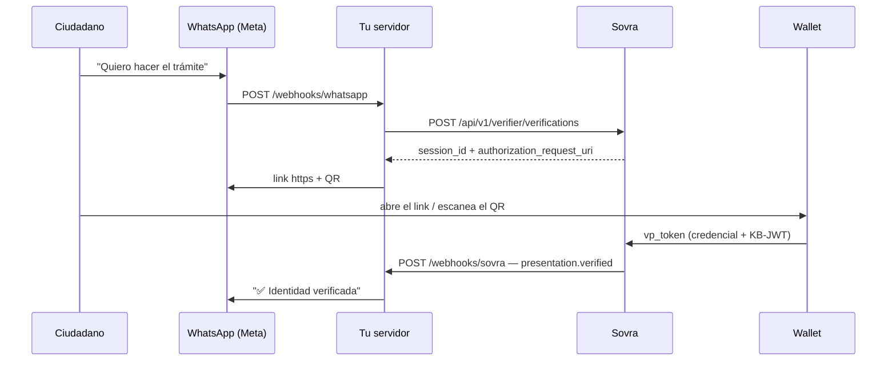

# 10. Verificar por WhatsApp

Las guías anteriores muestran el patrón hospedado: creás una sesión, mostrás un QR,
recibís un webhook. Esta guía lo baja a un canal concreto —**WhatsApp**— y resuelve
las tres fricciones que aparecen cuando el QR ya no está en una pantalla tuya sino
adentro de un chat.

Hay un boilerplate corriendo en
[`boilerplate/templates/whatsapp-meta/`](../../../boilerplate/templates/whatsapp-meta/):
Node + TypeScript + Express, habla directo con la Cloud API de Meta, sin BSP.

> Asume que el ciudadano **ya tiene la credencial** en su wallet. Si además tenés que
> emitirla, el flujo de oferta está en
> [3. Emisión de credenciales](03-emision-de-credenciales.md).

## Tabla de contenidos

1. [Por qué WhatsApp](#por-qué-whatsapp)
2. [El flujo completo](#el-flujo-completo)
3. [Fricción 1 — el deep link no es clickeable](#fricción-1--el-deep-link-no-es-clickeable)
4. [Fricción 2 — el webhook no sabe de qué chat viene](#fricción-2--el-webhook-no-sabe-de-qué-chat-viene)
5. [Fricción 3 — la credencial es válida, pero ¿es de quien escribe?](#fricción-3--la-credencial-es-válida-pero-es-de-quien-escribe)
6. [Las dos firmas HMAC](#las-dos-firmas-hmac)
7. [Configuración en Meta](#configuración-en-meta)
8. [La ventana de 24 horas](#la-ventana-de-24-horas)
9. [Checklist de producción](#checklist-de-producción)

---

## Por qué WhatsApp

Porque el ciudadano ya lo tiene abierto. No hay app que instalar, no hay portal
que recordar, no hay contraseña que recuperar. El trámite empieza donde la persona
ya está, y la credencial aporta lo único que al canal le falta: **saber con
certeza quién está del otro lado**.

El resultado es una autenticación más fuerte que la de un portal con usuario y
contraseña —la presentación se firma en vivo con la passkey del ciudadano— y con
menos fricción que un formulario.

## El flujo completo



La parte de Sovra es exactamente la de
[4. Verificación de credenciales](04-verificacion-de-credenciales.md): una sesión,
un DCQL, un webhook. Lo que cambia es el envoltorio.

**No le preguntes nada al ciudadano antes del link.** Es la tentación más común
—"escribime tu CUIL para buscarte"— y sobra: los datos vienen en el
`presentation.verified`, ya verificados y sin que nadie los tipee. Cada pregunta
que agregás antes del deep link es un paso más para abandonar el trámite, y un
dato más que estás tomando sin garantía ninguna. Un mensaje del ciudadano, un
link, y listo.

## Fricción 1 — el deep link no es clickeable

`authorization_request_uri` empieza con `openid4vp://`. WhatsApp **solo linkifica
`http` y `https`**: un esquema propio llega al chat como texto plano, sin enlace, y
el ciudadano tendría que copiarlo a mano.

La solución es un redirector propio. Guardás la URI al crear la sesión y exponés
una URL https que hace `302`:

```js
app.get("/w/:sessionId", (req, res) => {
  const session = store.getLiveSession(req.params.sessionId);
  if (!session) return res.status(410).send("El link venció");

  // 302, no 301: el destino cambia en cada sesión.
  res.redirect(302, session.authorizationRequestUri);
});
```

Y en el chat mandás `https://tu-servidor/w/<session_id>`, que sí es clickeable.

**Mandá también el QR como imagen.** Mucha gente lee WhatsApp desde la compu, y ahí
el link no le sirve: necesita escanear con el teléfono donde tiene la wallet.

```js
await sendImage(
  phone,
  `${PUBLIC_BASE_URL}/qr/${session.session_id}.png`,
  "Escaneá este código con la wallet donde tenés tu credencial.",
);
```

> ⚠️ La imagen la descarga **Meta**, no el ciudadano. La URL tiene que ser pública
> y alcanzable desde internet. Si apuntás a `localhost` o a un ngrok caído, el
> mensaje falla con el error `131014` de la Cloud API.

**La sesión vive 10 minutos.** Decilo en el mensaje y ofrecé regenerar el link. Si
el ciudadano vuelve tarde, lo más amable es darle uno nuevo sin preguntarle nada.

## Fricción 2 — el webhook no sabe de qué chat viene

El `presentation.verified` trae el `verification_id` y nada más. Sovra no conoce ni
el número de teléfono ni la conversación: eso es tuyo.

Guardá la correlación **en el momento de crear la sesión**:

```js
const session = await createVerification();

store.linkSession({
  sessionId: session.session_id,
  phone,                                  // el wa_id: adónde vas a contestar
  authorizationRequestUri: session.authorization_request_uri,
  expiresAt: session.expires_at,
});
```

Con eso alcanza. La conversación no necesita guardar nada más del ciudadano: lo
que sabés de él llega en el webhook.

Cuando llega el webhook, buscás por `verification_id` y ya sabés a quién
contestarle.

**Hacelo idempotente.** Sovra y Meta reintentan las entregas: el mismo evento puede
llegar más de una vez. Usá el `id` del sobre de Sovra y el `wamid` del mensaje de
WhatsApp como clave — y descartá la sesión al resolverla, así una verificación se
procesa una sola vez.

## Fricción 3 — la credencial es válida, pero ¿es de quien escribe?

Este es el punto que más se pasa por alto.

Recibir `presentation.verified` garantiza muchísimo: la credencial es auténtica,
está vigente, no fue revocada, y **quien la presentó es su titular** —la firmó en
vivo con su passkey contra un `nonce` que Sovra generó para esa sesión.

Lo que no garantiza es que ese titular sea **quien abrió este chat**. Sovra no sabe
nada del número de WhatsApp. Y el link que mandaste es reenviable: alguien puede
pasárselo a un tercero, pedirle que presente, y quedarse con una sesión iniciada a
nombre ajeno.

### Lo que no sirve: pedirle un dato y cotejarlo

La respuesta intuitiva es pedirle el CUIL antes del link y después compararlo con
el de la credencial. **No aporta seguridad.** Quien quiere hacerse pasar por otro
tipea el CUIL de esa otra persona: el cotejo da positivo y el ataque funciona
igual. Solo detecta confusiones honestas —el celular de un familiar, la wallet
equivocada—, y cuesta un paso más de conversación.

### Lo que sí sirve: atar la credencial al canal

Pedí el **teléfono** como claim y compará contra el `wa_id`:

```js
if (!samePhone(String(data.credentials[0].claims.phone ?? ""), session.phone)) {
  await sendText(session.phone, "La credencial es de otro número de teléfono.");
  return;
}
```

La diferencia es que el dato no lo elige el atacante: **no puede hacer que una
credencial ajena declare su propio número**. El link reenviado deja de servir.

Un detalle de implementación: los dos lados escriben el mismo número distinto. El
`wa_id` de Meta viene en E.164 sin `+` —y en Argentina con el 9 de celular
intercalado—, mientras que el claim viene como lo cargó el emisor, con `+`, con
espacios o con guiones. Comparar los strings crudos da falso negativo casi
siempre: normalizá a dígitos y compará los últimos 8, o normalizá a E.164 completo
si conocés el formato exacto con que tu emisor carga el claim.

Si tu esquema **no** lleva el teléfono, no hay cotejo posible y conviene saberlo:
el flujo sigue funcionando, pero un link reenviado asocia la identidad de otra
persona a ese chat. Si el trámite es sensible, sumá el claim al esquema antes de
salir a producción.

## Las dos firmas HMAC

Tenés dos webhooks entrando, y cada uno se firma distinto. Los dos calculan el HMAC
sobre el **cuerpo crudo**: si parseás y volvés a serializar, no coincide.

| Origen | Header | Secreto |
|---|---|---|
| Meta | `X-Hub-Signature-256: sha256=<hex>` | **App secret** (App → Settings → Basic) |
| Sovra | `X-Sovra-Signature: sha256=<hex>` | **Webhook secret** (Settings → Workspace) |

En Express eso significa `express.raw()` por ruta, y **nunca** un
`app.use(express.json())` global:

```js
app.post("/webhooks/sovra", express.raw({ type: "application/json" }), (req, res) => {
  const expected =
    "sha256=" + crypto.createHmac("sha256", SECRET).update(req.body).digest("hex");

  const a = Buffer.from(req.get("X-Sovra-Signature") ?? "");
  const b = Buffer.from(expected);
  if (a.length !== b.length || !crypto.timingSafeEqual(a, b)) return res.sendStatus(401);

  res.sendStatus(200);                       // respondé rápido
  handle(JSON.parse(req.body.toString()));   // y procesá en segundo plano
});
```

El detalle completo está en [5. Webhooks](05-webhooks.md#validar-la-firma-hmac).

## Configuración en Meta

Cinco pasos en [developers.facebook.com](https://developers.facebook.com):

| # | Dónde | Qué sacás |
|---|---|---|
| 1 | App de tipo **Business** + producto **WhatsApp** | — |
| 2 | WhatsApp → API Setup | **Phone number ID** |
| 3 | Business Settings → System Users | **Token permanente** (`whatsapp_business_messaging`, `whatsapp_business_management`) |
| 4 | App → Settings → Basic | **App secret** |
| 5 | WhatsApp → Configuration → Webhook | Callback URL + verify token, suscripto al campo **`messages`** |

Dos trampas del paso 5: el handshake es un `GET` con `hub.challenge` que tenés que
devolver en texto plano —**con el servidor ya corriendo**, o Meta no guarda la
URL— y hay que **suscribirse explícitamente al campo `messages`**; si no, la URL
queda configurada pero no llega nada.

El token temporal de la pantalla de API Setup dura **24 horas**. Sirve para la
primera prueba y para nada más.

## La ventana de 24 horas

WhatsApp deja responder libremente dentro de las **24 horas** desde el último
mensaje del ciudadano. Fuera de esa ventana, solo se pueden mandar **plantillas
aprobadas por Meta**.

El flujo de esta guía siempre arranca con un mensaje del ciudadano, así que entra
entero en la ventana libre — incluido el `presentation.verified`, que llega minutos
después.

Lo tenés que tener en cuenta si tu trámite **le escribe primero**: "tu licencia está
lista, verificá tu identidad para retirarla" necesita una plantilla aprobada, y la
aprobación tarda. Pedila con tiempo.

## Checklist de producción

- [ ] Las dos firmas HMAC validadas, sobre el cuerpo crudo y con comparación de
      tiempo constante.
- [ ] Idempotencia persistida sobre el `id` del evento de Sovra y el `wamid` de Meta.
- [ ] La correlación `session_id → conversación` en base de datos, no en memoria.
- [ ] El claim del teléfono en el esquema, y cotejado contra el `wa_id` — o la
      decisión consciente de no hacerlo.
- [ ] El DCQL pidiendo **el mínimo indispensable**: todos los claims son
      obligatorios, y cada uno de más baja la tasa de éxito.
- [ ] Ninguna pregunta antes del deep link: los datos vienen en el webhook.
- [ ] Los claims recibidos **no** se loguean: son datos personales verificados.
- [ ] `429` de la Cloud API manejado con reintento exponencial.
- [ ] Plantillas aprobadas, si el trámite escribe primero.

---

**Anterior:** [← 9. Verificación sin Sovra](09-verificacion-sin-sovra.md) · **Volver al [índice](README.md)** · **Código: [`boilerplate/templates/whatsapp-meta/`](../../../boilerplate/templates/whatsapp-meta/)**
